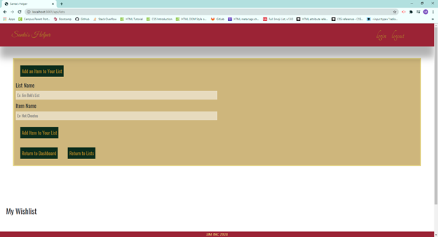

# Santa's Helper

## Description
Santa's Helper was created to help celebrate the Christmas Holiday! On the application, a user creates an account and then can either create a group or join an existing group. Once logged in, the users within each group will be able to see each other's posts. Users can post recipes, drinks, and wishlists. Once in the dashboard, the user is able to edit their own recipes, as well as add new recipes, and delete recipes. The same functions are able for adding, editing, and deleting drinks as well as adding, editing, and deleting wishlists. On the homepage, there is a countdown until Christmas Day to help you plan for your holiday.

## Images 
  
  
  
  

## Installation
    npm install
## Usage
    For personal use.
## License
    none
## Contributors
    Jessica Smith, js.jessicasmith774@gmail.com
    Maya Santiago, msatori.code@gmail.com 
    Joanna Grosshans, joannagrosshans2@gmail.com

## Tests
    
## Questions
[GitHub](https://github.com/jess-smith49/santas-helper)  
[Heroku webpage](https://stark-thicket-72427.herokuapp.com/)  

# Technologies used
 * JS  
 * Node  
 * MYSQL2 
 * SEQUELIZE 
 * EXPRESS-HANDLEBARS 
 * MYSQL2 
 * DOTENV 
 * BCRYPT 
 * EXPRESS-SESSION 
 * CONNECT-SESSION-SEQUELIZE 
 * SASS 
 * SHORT-UNIQUE-ID
